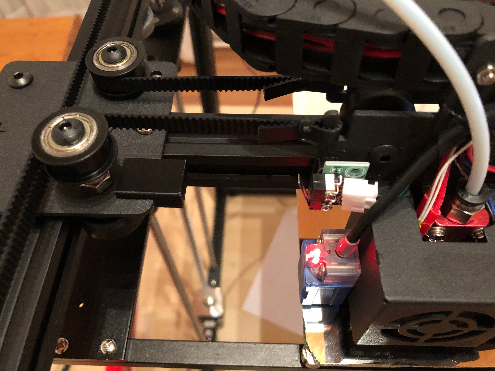

# Printbed auto-level issues

## X-axis stopper

When homing the printhead, the Z-level sensor was parked outside of the printbed (x-wise) when it was trying to move Z to zero. The sensor could not detect the heatbed thus the printbed crashed into the nozzle.

I printed a small stopper to offset X-zero a little bit (8.6 mm) to the right. Now, when homing, the Z-level sensor parks right next to the edge of the printbed and can detect it.

[Print it!](stl/X-Axis%20Stopper%20v1.stl)

## Z-axis sensor

I did not use the stock printbed, but changed it for a 2mm mirror. Glas would work just alike but the mirror looks awesome. If you want to print with higher (bed-)temperatures maybe borosilicate glass would be safer. My glazier had no 2mm borosilicate on stock so I went with the mirror.

As the glas is thicker than the stock printbed the Z-sensor didn't detect the bed and the bed drove against the nozzle again. I couldn't lower the z-axis sensor anymore so I disassembled the metal extruder enclosure and drilled 2 new holes and cut M3 threads to be able to mount the sensor ~4 mm lower (and some mm into Y to not collide with the old holes). 